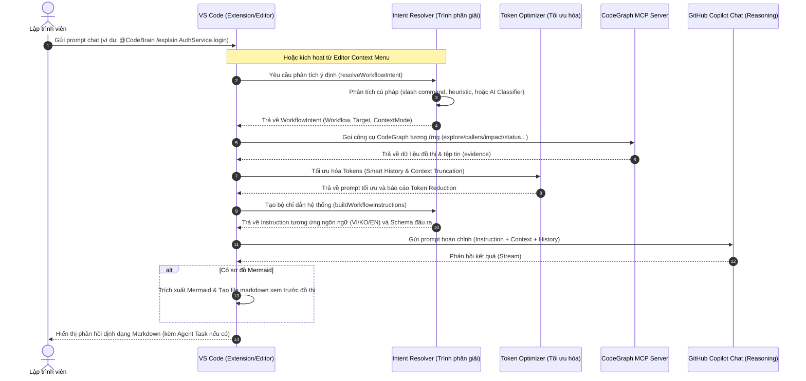

# Luồng Hoạt Động Của CodeBrain VS Code Extension

Tài liệu này giải thích chi tiết luồng hoạt động nội bộ (internal runtime flow), cơ chế điều phối quy trình (workflow orchestration), thu thập ngữ cảnh từ đồ thị (graph context retrieval), tối ưu hóa token và tích hợp với GitHub Copilot Chat trong extension CodeBrain.

---

## 🗺️ Tổng Quan Luồng Hoạt Động (High-Level Architecture)

Quy trình xử lý một yêu cầu từ nhà phát triển của CodeBrain trải qua 5 giai đoạn cốt lõi:

```text
Ý định của Dev (Intent)
 └─► 1. Nhận diện Ý định (Intent Resolution) -> Xác định Workflow & Target
      └─► 2. Thu thập đồ thị (Graph Retrieval) -> Gọi MCP Tools lấy cấu trúc code
           └─► 3. Tối ưu hóa Ngữ cảnh (Context Optimization) -> Giảm thiểu Tokens
                └─► 4. Hướng dẫn & Lập luận (Instructions & Reasoning) -> Tạo prompt
                     └─► 5. Tạo Nhiệm vụ (Agent Task Generation) -> Copilot Agent chạy
```

---

## 🔄 Sơ Đồ Trực Quan (Execution Sequence Diagram)

Dưới đây là sơ đồ tương tác tuần tự giữa các thành phần khi một lệnh được thực thi:



---

## 🔍 Chi Tiết Từng Giai Đoạn

### Giai Đoạn 1: Nhận diện Ý định (Intent Resolution)
Tệp tin xử lý chính: [`src/workflows/intent-resolver.ts`](file:///d:/me/AI/repo/gitnexus-vscode/src/workflows/intent-resolver.ts)

Khi người dùng gửi tin nhắn hoặc nhấn một mục trong menu chuột phải, hệ thống sẽ thực hiện phân loại:
1. **Phân tích Slash Command**: Nhận diện các lệnh như `/explain`, `/impact`, `/architecture`...
2. **Editor Context Extraction**: Nếu không chỉ định rõ tệp tin hay ký hiệu (symbol) trong prompt, CodeBrain sẽ tự động lấy thông tin từ tệp tin đang mở, đoạn text đang chọn, vị trí con trỏ chuột, hoặc symbol tại con trỏ.
3. **Phân loại bằng AI (AI Intent Classification)**: Nếu cách phân tích thông thường có độ tin cậy thấp, hệ thống sẽ gửi một prompt ẩn đến mô hình ngôn ngữ lớn (LLM) thông qua `resolveIntentWithAI` để phân loại yêu cầu vào 1 trong 11 workflows được hỗ trợ và trích xuất symbol/file đích.
4. **Xác định Context Mode**: Gán chế độ tối ưu hóa tokens (`compact`, `balanced`, hoặc `full`) phù hợp với workflow đó.

---

### Giai Đoạn 2: Thu thập Đồ thị Ngữ cảnh (Repository Graph Retrieval)
Tệp tin xử lý chính: [`src/ui/chat-participant.ts`](file:///d:/me/AI/repo/gitnexus-vscode/src/ui/chat-participant.ts) và [`src/process/cli-runner.ts`](file:///d:/me/AI/repo/gitnexus-vscode/src/process/cli-runner.ts)

Thay vì gửi toàn bộ mã nguồn thô cho AI, CodeBrain truy vấn đồ thị quan hệ trong thư mục `.codegraph` để chọn lọc ngữ cảnh:
- **Lựa chọn MCP Tool phù hợp**:
  - Với `/architecture`: dùng `codegraph_explore` để lấy cấu trúc thư mục và cụm phụ thuộc.
  - Với `/impact`: dùng `codegraph_explore` để quét blast radius, tìm các hàm gọi (callers) ở cấp độ liên kết trực tiếp `d=1`.
  - Với `/plan`: bổ sung các MCP tools ngoài đồ thị như `atlassian`, `jira`, `confluence` để lấy tài liệu mô tả yêu cầu nghiệp vụ.
- **Tiến trình gọi tuần tự (Progressive Tool Execution)**: Hệ thống chạy các công cụ trong tối đa 3 vòng (`MAX_TOOL_CALL_ROUNDS`). Các thông tin thu thập được bao gồm: định nghĩa lớp/hàm, danh sách hàm gọi upstream/downstream, phạm vi ảnh hưởng và các tệp tin liên quan.

---

### Giai Đoạn 3: Tối ưu hóa Ngữ cảnh & Tokens (Context Optimization)
Tệp tin xử lý chính: [`src/process/token-optimizer.ts`](file:///d:/me/AI/repo/gitnexus-vscode/src/process/token-optimizer.ts)

Để đảm bảo không bị tràn cửa sổ ngữ cảnh và tăng tốc độ xử lý của mô hình, CodeBrain thực hiện tối ưu hóa tokens:
1. **Smart History Management (Quản lý lịch sử thông minh)**: Tự động giới hạn số lượt chat được gửi đi (`historyTurnLimit`) và số lượng ký tự tối đa của mỗi lượt (`historyCharsPerTurn`). Nếu tổng số token ước tính vượt quá ngân sách (`tokenBudget` của chế độ tương ứng), hệ thống sẽ giảm dần kích thước ký tự hoặc loại bỏ các lượt trò chuyện cũ hơn.
2. **Cắt giảm Ngữ cảnh Công cụ (Evidence Truncation)**: Giới hạn số ký tự trả về từ kết quả của các công cụ MCP theo bảng giới hạn (`GROUNDING_CHAR_LIMITS`) tương ứng với từng chế độ `compact`, `balanced`, hoặc `full`.
3. **Báo cáo Tiết kiệm (Token Reduction Report)**: Nếu tùy chọn `codebrain.showContextReport` được bật, hệ thống sẽ tính toán số lượng tokens trước và sau khi tối ưu hóa để hiển thị cho người dùng.

---

### Giai Đoạn 4: Hướng dẫn Lập luận & Định dạng Đầu ra (Instructions & Output Schema)
Tệp tin xử lý chính: [`src/workflows/intent-resolver.ts`](file:///d:/me/AI/repo/gitnexus-vscode/src/workflows/intent-resolver.ts)

Hệ thống tiến hành đóng gói prompt gửi đi:
1. **Nhận diện Ngôn ngữ (`detectLanguage`)**: Tự động phát hiện ngôn ngữ của tệp tin cấu hình VS Code hoặc từ chính prompt của người dùng (hỗ trợ Tiếng Việt, Tiếng Hàn và Tiếng Anh).
2. **Tạo Instruction Chỉ Định**: Bắt buộc AI chỉ được trả lời dựa trên bằng chứng thu thập được (CodeGraph evidence), không được tự đoán mò.
3. **Định dạng cấu trúc đầu ra bắt buộc (Mandatory Output Schema)**: Áp đặt cấu trúc tiêu đề nghiêm ngặt dựa trên ngôn ngữ được phát hiện. Ví dụ đối với Tiếng Việt:
   - Workflow `/explain`: `Luồng xử lý chính` -> `Luồng dữ liệu` -> `Sơ đồ luồng`.
   - Workflow `/review`: `Phạm vi thay đổi` -> `Kết quả phân tích` -> `Ảnh hưởng / Rủi ro` -> `Khuyến nghị / Hành động` -> `Các bước kiểm chứng`.
4. **Giải thích Ngữ cảnh (Mandatory Explainability)**: Yêu cầu AI ghi rõ: tệp nào đã quét, tệp nào được chọn, lý do chọn và lượng token đã được tối ưu.

---

### Giai Đoạn 5: Tạo Nhiệm vụ và Thực thi (Agent Task Generation)
Tệp tin xử lý chính: [`src/workflows/development-lifecycle.ts`](file:///d:/me/AI/repo/gitnexus-vscode/src/workflows/development-lifecycle.ts)

Với các workflow mang tính triển khai hoặc thay đổi code như `/plan`, `/develop`, `/fix`, `/test`, đầu ra cuối cùng của CodeBrain không phải là việc trực tiếp sửa đổi tệp tin (tránh rủi ro thay đổi sai diện rộng), mà là tạo ra một **Copilot Agent Task**:
- **Cấu trúc Agent Task**: Bao gồm yêu cầu nghiệp vụ, danh sách tệp tin cần sửa đổi, các ràng buộc kỹ thuật, phân tích rủi ro, danh sách kiểm thử và các bước xác minh.
- **Tiêu chuẩn thực thi**: Nhiệm vụ này được định dạng tối ưu để người dùng có thể sao chép trực tiếp vào Copilot Agent (hoặc chạy trực tiếp thông qua cơ chế Agent của VS Code) để Agent tự động thực hiện các chỉnh sửa mã nguồn một cách an toàn và có kiểm soát.
